# DeGesh CRM Business Process

```mermaid
flowchart LR
  start(["?????"]) --> auth["???? ? CRM"]
  auth --> dashboard["???????"]

  dashboard --> request["?????? / ??? ???????"]
  dashboard --> masterData["?????????? ????????????"]
  dashboard --> imports["?????? ?????? ?? 1C ? ?????????? ?????"]

  subgraph md["???????????"]
    employees["??????????"]
    customers["?????????? / ???????"]
    suppliers["??????????"]
    products["??????"]
    counterparties["??????????? ?? 1C"]
  end

  masterData --> employees
  masterData --> customers
  masterData --> suppliers
  masterData --> products
  masterData --> counterparties

  subgraph procurement["????? ? ?????? ??????"]
    supplierCard["???????? ??????????"]
    supplierItems["??????? ??????????"]
    incoming["?????? ??????"]
    receipts["?????? ???????????"]
    inventory["??????? inventory"]
    warehouseStock["??????? ?? ???????"]
  end

  suppliers --> supplierCard
  supplierCard --> supplierItems
  supplierItems --> incoming
  incoming --> receipts
  receipts --> inventory
  receipts --> warehouseStock

  subgraph sales["??????? ???????"]
    qualify["???????????? ??????"]
    customerCard["???????? ???????"]
    contract["???????"]
    contractItems["??????? ????????"]
    paymentTerms["?????? ?????"]
    document["???????? ???????? DOCX/PDF"]
    reserveCheck{"????? ?????????"}
    reservation["?????? ??????"]
    shipment["????????"]
  end

  request --> qualify
  customers --> customerCard
  qualify --> customerCard
  customerCard --> contract
  contract --> contractItems
  products --> contractItems
  contractItems --> paymentTerms
  contract --> document
  contractItems --> reserveCheck
  inventory --> reserveCheck
  reserveCheck -- "??" --> reservation
  reserveCheck -- "???" --> incoming
  reservation --> shipment

  subgraph ext["??????????????? ????????"]
    contractFiles["????? ?????????"]
    extract["?????????? ??????"]
    extContracts["ext_contracts"]
    appendices["ext_appendices"]
    appendixItems["ext_appendix_items"]
    extShipments["shipments"]
  end

  imports --> contractFiles
  contractFiles --> extract
  extract --> extContracts
  extContracts --> appendices
  appendices --> appendixItems
  appendixItems --> extShipments
  extShipments --> shipment

  subgraph finance["??????? ? ????????"]
    realizations["?????? ??????????"]
    debts["?????? ?????????????"]
    debtors["????????"]
    paymentControl{"?????? ????????"}
    overdue["???????? ?????????"]
    closed["?????? ???????"]
  end

  shipment --> realizations
  paymentTerms --> paymentControl
  realizations --> paymentControl
  debts --> debtors
  debtors --> paymentControl
  paymentControl -- "??" --> closed
  paymentControl -- "???" --> overdue
  overdue --> debtors

  subgraph analytics["????????? ? ????????? ???????"]
    salesAnalytics["????????? ??????"]
    inventoryAnalytics["????????? ??????"]
    leads["???? / ????????? ?????"]
    nextAction["????????? ???????? ?????????"]
  end

  realizations --> salesAnalytics
  inventory --> inventoryAnalytics
  warehouseStock --> inventoryAnalytics
  debtors --> leads
  salesAnalytics --> leads
  leads --> nextAction
  nextAction --> request

  closed --> salesAnalytics
  closed --> nextAction

  classDef source fill:#eff6ff,stroke:#2563eb,color:#0f172a;
  classDef stock fill:#ecfdf5,stroke:#16a34a,color:#052e16;
  classDef sales fill:#fff7ed,stroke:#f97316,color:#431407;
  classDef finance fill:#fef2f2,stroke:#dc2626,color:#450a0a;
  classDef analytics fill:#f5f3ff,stroke:#7c3aed,color:#2e1065;

  class employees,customers,suppliers,products,counterparties source;
  class supplierCard,supplierItems,incoming,receipts,inventory,warehouseStock stock;
  class qualify,customerCard,contract,contractItems,paymentTerms,document,reserveCheck,reservation,shipment sales;
  class realizations,debts,debtors,paymentControl,overdue,closed finance;
  class salesAnalytics,inventoryAnalytics,leads,nextAction analytics;
```

## Process Notes

- Source of truth for the ER schema is `FastAPIProject/app/models`.
- The operational sales chain is `customers -> contracts -> contract_items -> payment_terms -> reservations`.
- The stock chain is `suppliers -> supplier_items -> inventory_receipts -> inventory / warehouse_stock`.
- Imported accounting and historical data feed analytics through `realizations`, `debts`, `counterparties`, and the `ext_*` contract tables.
